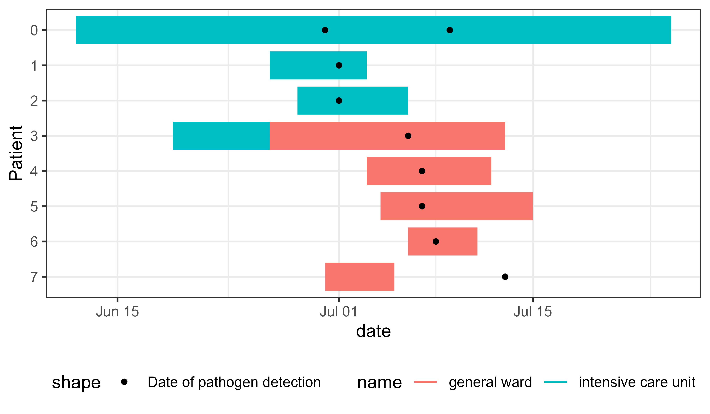
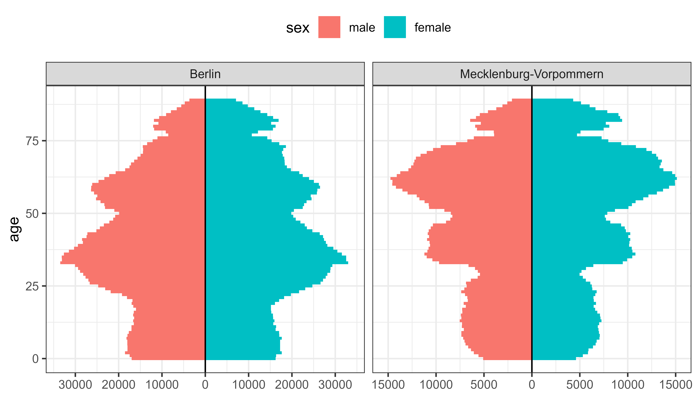

# ggsurveillance 

<!-- badges: start -->

[](https://CRAN.R-project.org/package=ggsurveillance) [](https://cran.r-project.org/package=ggsurveillance) [](https://lifecycle.r-lib.org/articles/stages.html#experimental) [](https://github.com/biostats-dev/ggsurveillance/actions/workflows/R-CMD-check.yaml) [](https://app.codecov.io/gh/biostats-dev/ggsurveillance)

<!-- badges: end -->

**ggsurveillance** is an R package with helpful tools and ggplot extensions for epidemiology, especially infectious disease surveillance and outbreak investigation. All functions provide tidy functional interfaces for easy integration with the tidyverse. For documentation and vignettes see: <a href="https://ggsurveillance.biostats.dev" target="_blank">ggsurveillance.biostats.dev</a>

## Key Features

### 📊 Epidemic Curves
-   `geom_epicurve()`: A ggplot geom for plotting epicurves.
    -   `stat_bin_date()`: Date interval (week, month etc.) based binning of case numbers with perfect alignment with e.g. reporting week.
    -   `geom_epicurve_text()` and `geom_epicurve_point()`: New geoms to easily add text annotations or points to cases in epidemic curves.
    -   `geom_vline_year()`: Automatically detects the turn of the year(s) from the date or datetime axis and draws a vertical line.
    -   `scale_y_cases_5er()`: For better (case) count axis breaks and positioning.

### 📅 Date & Time Transformations
-   `bin_by_date()`: A `tidyverse`-compatible function for flexible date-based aggregation (binning).

-   `align_dates_seasonal()`: Align surveillance data for seasonal plots (e.g. flu season).

### 📈 Specialized Epi Visualizations
-   `geom_bar_diverging()`: A geom for diverging bar charts, which can be used to plot population pyramids, likert scales (sentiment analyses) and other data with opposing categories, like vaccination status or imported vs autochthonous (local) infections.
    -   `stat_diverging()` for easy labeling of these charts with category counts/percentages or total counts/percentages
    -   `scale_x_continuous_diverging()` for symmetric diverging scales
    -   `geom_area_diverging()` for continuous variables (e.g. changes over time)

-   `geom_epigantt()`: A geom for epigantt plots. Helpful to visualize overlapping time intervals for contact tracing (e.g. hospital outbreaks).
    -   including `scale_y_discrete_reverse()` which reverses the order of the categorical scale.

### 🎨 ggplot2 Extensions & Theme Modifications
-   More `ggplot2` add-ons: 
    -   `guide_axis_nested_date()`: An axis guide for creating nested date labels for hierarchical time periods (e.g., year > month > day).
    -   `geom_label_last_value()`: A geom for labeling the last value of a time series (e.g. `geom_line()`). 
    -   `label_power10()`: A `ggplot2`-compatible labeling function to format numbers in scientific notation with powers of 10 (e.g., $2 \times 10^5$).

-   `theme_mod_` functions for ggplot2 theme modifications:

    -   `theme_mod_legend_position()` etc. to adjust the legend positions.
    -   `theme_mod_rotate_x_axis_labels()` etc. for rotating x axis labels.
    -   `theme_mod_remove_minor_grid()` etc. to remove the minor grid lines (x, y or both) or all grid lines.

### 🔧 Other Utilities
-   `create_agegroups()`: Create reproducible age groups with highly customizable labels.

-   Additional utilities: `geometric_mean()`, `expand_counts()`, and more

## Examples

### Creating Epicurves

``` r
library(ggplot2)
library(tidyr)
library(outbreaks)
library(ggsurveillance)

sars_canada_2003 |> #SARS dataset from outbreaks
  pivot_longer(starts_with("cases"), 
               names_prefix = "cases_", 
               names_to = "origin") |>
  ggplot(aes(x = date, weight = value, fill = origin)) +
  geom_epicurve(date_resolution = "week") +
  geom_epicurve_text(aes(label = ifelse(origin == "travel", "🛪", "")), 
                     date_resolution = "week", size = 1.5, color = "white") + 
  scale_x_date(date_labels = "W%V'%g", date_breaks = "2 weeks") +
  scale_y_cases_5er() +
  scale_fill_brewer(type = "qual", palette = 6) +
  theme_classic()
```


### Align surveillance data for seasonal comparison

``` r
library(ggplot2)
library(dplyr)
library(ggsurveillance)

influenza_germany |>
  filter(AgeGroup == "00+") |>
  align_dates_seasonal(dates_from = ReportingWeek,
                       date_resolution = "isoweek",
                       start = 28) -> df_flu_aligned

ggplot(df_flu_aligned, aes(x = date_aligned, y = Incidence)) +
  stat_summary(
    aes(linetype = "Historical Median (Min-Max)"), data = . %>% filter(!current_season), 
    fun.data = median_hilow, geom = "ribbon", alpha = 0.3) +
  stat_summary(
    aes(linetype = "Historical Median (Min-Max)"), data = . %>% filter(!current_season), 
    fun = median, geom = "line") +
  geom_line(
    aes(linetype = "2024/25"), data = . %>% filter(current_season), colour = "dodgerblue4", linewidth = 2) +
  labs(linetype = NULL) +
  scale_x_date(date_breaks = "month", date_labels = "%b'%Y", 
               guide = guide_axis_nested_date()) +
  theme_bw() +
  theme_mod_legend_position(position.inside = c(0.2, 0.8))
```


### Create Epigantt plots to visualize exposure intervals in outbreaks

``` r
library(dplyr)
library(tidyr)
library(ggplot2)
library(ggsurveillance)

# Transform to long format
linelist_hospital_outbreak |>
  pivot_longer(
    cols = starts_with("ward"),
    names_to = c(".value", "num"),
    names_pattern = "ward_(name|start_of_stay|end_of_stay)_([0-9]+)",
    values_drop_na = TRUE
  ) -> df_stays_long

linelist_hospital_outbreak |>
  pivot_longer(cols = starts_with("pathogen"), values_to = "date") -> df_detections_long

# Plot
ggplot(df_stays_long) +
  geom_epigantt(aes(y = Patient, xmin = start_of_stay, xmax = end_of_stay, color = name)) +
  geom_point(aes(y = Patient, x = date, shape = "Date of pathogen detection"), data = df_detections_long) +
  scale_y_discrete_reverse() +
  theme_bw() +
  theme_mod_legend_bottom()
```



### Create Diverging Bar Charts

Useful for population pyramids, vaccination status, likert scales (sentiment) etc.

``` r
library(dplyr)
library(ggplot2)
library(ggsurveillance)

population_german_states |>
  filter(state %in% c("Berlin", "Mecklenburg-Vorpommern"), age < 90) |>
  ggplot(aes(y = age, fill = sex, weight = n)) +
  geom_bar_diverging(width = 1) +
  geom_vline(xintercept = 0) +
  scale_x_continuous_diverging(n.breaks = 7) +
  facet_wrap(~state, scales = "free_x") +
  theme_bw() +
  theme_mod_legend_top()
```


