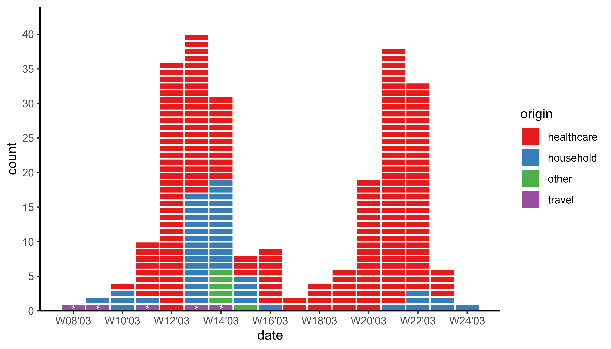
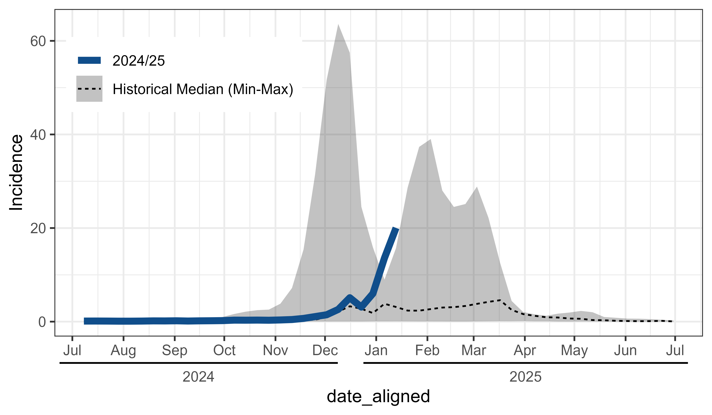

# ggsurveillance 

<!-- badges: start -->

[](https://lifecycle.r-lib.org/articles/stages.html#experimental)
[](https://github.com/biostats-dev/ggsurveillance/actions/workflows/R-CMD-check.yaml)
[](https://app.codecov.io/gh/biostats-dev/ggsurveillance)
<!-- badges: end -->

**ggsurveillance** is an R package with helpful tools and ggplot extensions for epidemiology, especially infectious disease surveillance and outbreak investigation. All functions provide tidy functional interfaces for easy integration with the tidyverse. For documentation and vignettes see: <a href="https://ggsurveillance.biostats.dev" target="_blank">ggsurveillance.biostats.dev</a>

This packages provides:

-   `geom_epicurve()` : A ggplot geom for plotting epicurves
    -   including `state_bin_date()` for date interval (week, month etc.) based binning of case numbers with perfect alignment with i.e. reporting week. 
    -   including `scale_y_cases_5er()` for better (case) count axis breaks and positioning.
    -   including `geom_vline_year()`, which automatically detects the turn of the year(s) from the date or datetime axis and draws a vertical line.

-   `align_dates_seasonal()` : Align surveillance data for seasonal plots (e.g. flu season).

-   `create_agegroups()`: Create reproducible age groups with highly customizable labels.

-   `geom_epigantt()` : A geom for epigantt plots. Helpful to visualize overlapping time intervals for contact tracing (i.e. hospital outbreaks). (Beta)

-   and more: `geometric_mean()` , `expand_counts()`,

## Creating Epicurves

``` r
library(ggplot2)
library(tidyr)
library(outbreaks)
library(ggsurveillance)

sars_canada_2003 |> #SARS dataset from outbreaks
  pivot_longer(starts_with("cases"), 
               names_prefix = "cases_", 
               names_to = "origin") |>
  ggplot(aes(x = date, weight = value, fill = origin)) +
  geom_epicurve(date_resolution = "week") +
  scale_x_date(date_labels = "W%V'%g", date_breaks = "2 weeks") +
  scale_y_cases_5er() +
  scale_fill_brewer(type = "qual", palette = 6) +
  theme_classic()
```



## Align surveillance data for seasonal comparison

``` r
library(ggplot2)
library(ggsurveillance)

influenza_germany |>
  filter(AgeGroup == "00+") |>
  align_dates_seasonal(dates_from = ReportingWeek,
                       date_resolution = "isoweek",
                       start = 28) -> df_flu_aligned

ggplot(df_flu_aligned, aes(x = date_aligned, y = Incidence)) +
  stat_summary(
    aes(linetype = "Historical Median (Min-Max)"), data = . %>% filter(!current_season), 
    fun.data = median_hilow, geom = "ribbon", alpha = 0.3) +
  stat_summary(
    aes(linetype = "Historical Median (Min-Max)"), data = . %>% filter(!current_season), 
    fun = median, geom = "line") +
  geom_line(
    aes(linetype = "2024/25"), data = . %>% filter(current_season), colour = "dodgerblue4", linewidth = 2) +
  labs(linetype = "") +
  scale_x_date(date_labels = "%b'%y") +
  theme_bw() +
  theme(legend.position = c(0.2,0.8))
```



## Installation

Install the development version with:

``` r
devtools::install_github("biostats-dev/ggsurveillance")

# or directly with renv:
renv::install("biostats-dev/ggsurveillance")
```
